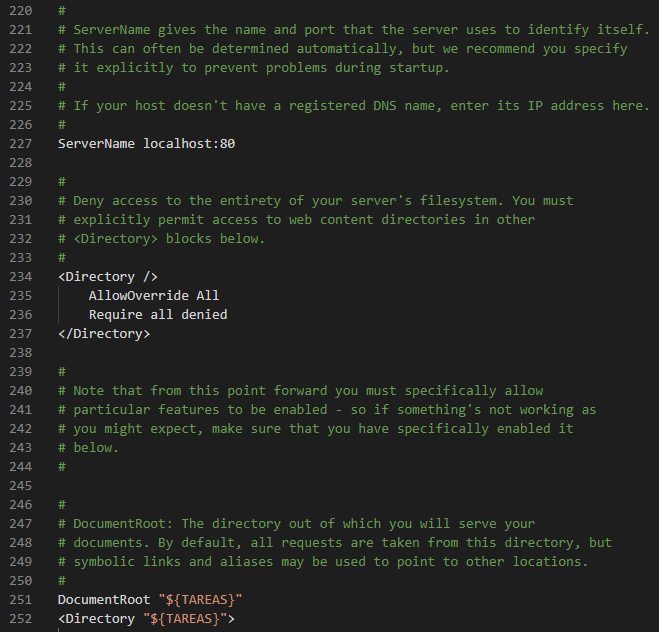

# Instalación de PostgreSQL, PHP y Apache

## ¿Qué estamos instalando?

Básicamente, necesitamos tres componentes para poder montar una página web:

* **La base de datos:** En este caso, utilizaremos **PostgreSQL 12.**
* **El lenguaje de código de servidor:** Para poder comunicar el web server con la base de datos. En este caso, utilizaremos **PHP 7.3+.**
* **El web server:** Para poder montar los recursos y visualizarlos de forma local. En este caso, utilizaremos **Apache 2.4.**

## Nota para usuarios en Linux

Esta guía de instalación está enfocada principalmente para usuarios en Windows. Si necesita instalar estos recursos en alguna distribución de linux, presentamos algunos links que pueden ser útiles a continuación:

Links Oficiales:

* PostgreSQL: [https://www.postgresql.org/download/](https://www.postgresql.org/download/)
* Apache 2.4: [https://httpd.apache.org/docs/current/install.html](https://httpd.apache.org/docs/current/install.html)
* PHP: [https://www.php.net/manual/en/install.unix.apache2.php](https://www.php.net/manual/en/install.unix.apache2.php)

Algunos links útiles si trabajará en **Fedora:**

* [https://docs.fedoraproject.org/en-US/quick-docs/getting-started-with-apache-http-server/](https://docs.fedoraproject.org/en-US/quick-docs/getting-started-with-apache-http-server/)
* [https://kifarunix.com/install-apache-on-fedora-30/](https://kifarunix.com/install-apache-on-fedora-30/)

Otras guías no oficiales. **Manejar con cuidado:**

* [https://computingforgeeks.com/install-postgresql-12-on-ubuntu/](https://computingforgeeks.com/install-postgresql-12-on-ubuntu/)
* [https://computingforgeeks.com/how-to-install-postgresql-12-on-fedora/](https://computingforgeeks.com/how-to-install-postgresql-12-on-fedora/)
* [https://medium.com/@Riverside/how-to-install-apache-php-postgresql-lapp-on-ubuntu-16-04-adb00042c45d](https://medium.com/@Riverside/how-to-install-apache-php-postgresql-lapp-on-ubuntu-16-04-adb00042c45d)
* [https://www.linux-party.com/92-php/7910-instalar-un-servidor-lapp-linux--apache-postgresql-php](https://www.linux-party.com/92-php/7910-instalar-un-servidor-lapp-linux--apache-postgresql-php) \(CUIDADO: las versiones están desactualizadas. Intenten con los otros links primero\)


Recomendamos verificar la instalación de las tecnologías a la brevedad, para poder solucionar problemas lo más pronto posible.



Por favor verificar que se están instalando las últimas versiones de las tecnologías a usar; es posible que tutoriales en internet estén desactualizados en cuanto a las versiones.


### Algunos consejos

* Es recomendable siempre instalar programas y paquetes utilizando el gestor de paquetes correspondiente a la distribución \(apt en Ubuntu, dnf en Fedora, etc\).
*  Puede ser útil usar **uname -a** si se está en linux para conocer más detalles de la versión del sistema operativo.
* Para ver si está disponible algún paquete de manera oficial en Ubuntu/Fedora, pueden utilizar el comando **sudo apt search &lt;paquete&gt;** en Ubuntu y **sudo dnf provides &lt;paquete&gt;** en Fedora.

## Instalación de PostgreSQL


**En el ramo se trabajará con la versión PostgreSQL 12.** 


* [ ] Vaya a [https://www.postgresql.org/](https://www.postgresql.org/) y haga click en **Downloads.**
* [ ] En la sección **Binary Packages,** seleccione su sistema operativo.
* [ ] Siga las instrucciones de instalación según su sistema operativo.
  * En Windows y MacOS, haga click en **Download the installer** y descargue el instalador.
* [ ] **\(Recomendado\)** Instale también **pgAdmin4.** En Windows/MacOS, revise que esté checkeado el componente en el instalador.
* [ ] El instalador le pedirá una contraseña para el super usuario. Escriba una contraseña que pueda recordar y sea segura.


**Por seguridad, no use de contraseña "postgres"!**


**pgAdmin4** es una plataforma de administración y desarrollo para bases de datos en PostgreSQL, la cual les puede ser útil y cómoda a la hora de trabajar. Sin embargo, también se puede trabajar desde la consola.

### Configuración de Windows para trabajar con la consola.

#### Incluir psql a la variable de entorno PATH

* [ ] En el menú de windows busque **"Editar las variables de entorno del sistema"** o **"Edit the system enviroment variables".**
* [ ] En "Opciones avanzadas", presione el botón **Variables de entorno.**
* [ ] En la **Sección Inferior \(Variables del Sistema\),** encuentre la variable "Path" y haga doble click en ella.
* [ ] Seleccione "Examinar" y busque la carpeta donde se instaló PostgreSQL, usualmente **C:\Archivos de Programa\PostgreSQL\12\bin.**
* [ ] Verifique que el ****directorio se añadió correctamente a la lista de valores, guarde los cambios.
* [ ] Compruebe sus cambios: abra un Símbolo del Sistema y pruebe a ejecutar `psql -U postgres`. Si le pide la contraseña para el usuario postgres, la configuración ha sido exitosa.

#### Cambiar la Console Code Page

Si ingresan a PostgreSQL desde la consola \(a través del comando de la sección anterior\) es posible que les aparezca una advertencia como la siguiente:


Si eso ocurre, es posible que algunos caracteres especiales se visualicen incorrectamente. Si desea que no sea así, siga los siguientes pasos:

* [ ] Salga de psql con el comando `quit`.
* [ ] Ejecute `cmd.exe /c chcp 1252`.


Dicho comando deberá ser ejecutado **cada vez que se quiera abrir postgres en una consola.** Para hacer el cambio permanente, se deben editar los registros del computador, lo cual puede ser peligroso y por tanto no enseñaremos como hacerlo. _El equipo de ayudantes de bases de datos no se hace responsable si desconfigura algún elemento importante de su PC intentando modificar los registros._


### Abriendo pgAdmin4 por primera vez

Si prefiere, puede utilizar la interfaz de pgAdmin por sobre la consola para manejar la base de datos:

* [ ] Abra la aplicación de pgAdmin4. Esta inicializará un servidor de pgAdmin y abrirá en una pestaña de su navegador predeterminado.
* [ ] La primera vez que abra pgAdmin, le pedirá una contraseña para poder acceder al mismo y poder recuperar información sobre los usuarios configurados y acceder a las bases de datos.
* [ ] En la pestaña de la izquierda abra Servers -&gt; PostgreSQL 12 -&gt; postgres \(base de datos por defecto que crea Postgres; en otra sección se verá cómo crear otras bases de datos\). pgAdmin pedirá la contraseña para el super usuario y da la opción de recordarla.
* [ ] Teniendo postgres \(u otra base de datos\) **seleccionada,** presione el botón **Query Tool** \(o vaya a Tools -&gt; Query Tool\). Esto abrirá una hoja para hacer consultas en SQL. Compruebe que la abrió en la base de datos apropiada.


Si logró hacer correctamente todos los pasos anteriores, entonces podrá utilizar PostgreSQL sin mayores problemas.


Si no va a trabajar más en pgAdmin, además de cerrar la pestaña del navegador, recuerde apagar el servidor de pgAdmin que aparece en íconos ocultos.


## Instalación de Apache

* [ ] Descargue el código fuente del [siguiente link.](https://www.apachelounge.com/download/)
* [ ] Descomprima el zip y copie la carpeta Apache24 a la raíz **C:\.**
* [ ] Descargue e instale **Microsoft Visual C++** a través de [este link.](https://support.microsoft.com/en-us/help/2977003/the-latest-supported-visual-c-downloads) Las descargas para 32 y 64 bits están en la sección "Visual Studio 2015, 2017 and 2019". Deberá reiniciar su equipo para completar la instalación.
* [ ] Abra el archivo **C:\Apache24\conf\httpd.conf** y haga las siguientes modificaciones:
  * [ ] Agregue una línea que defina dónde estará su directorio de trabajo, de la forma `Define TAREAS "c:/donde/guarde/sus/tareas"`. Guíese por la imagen abajo \(línea 38\). **Debe utilizar forward-slash, no backslash y no debe terminar con un slash.** De esta forma, podrá modificar la configuración fácilmente para cambiar de tarea.
  * [ ] Modificar `#ServerName www.example.com:80` por `ServerName localhost:80` \(línea 227\). **Recuerde eliminar el \#.**
  * [ ] Modificar `AllowOverride none` por `AllowOverride All` \(línea 235\).
  * [ ] Modificar `DocumentRoot "${SRVROOT}/htdocs"` y `<Directory "${SRVROOT}/htdocs">` a su dirección de tareas `"S{TAREAS}"` \(líneas 251 y 252\).




* [ ] Ejecute un Símbolo del Sistema **como Administrador** en **C:\Apache24\bin.** Para eso utilice el comando `cd C:\Apache24\bin`.
* [ ] Ejecute el comando `httpd -k install`.
* [ ] Para comprobar la instalación, copie el archivo de ejemplo que está en **C:\Apache24\htdocs\index.html** en el directorio que definió para su tarea. Luego, ejecute `hpptd -k start` y abra una pestaña de navegador a [http://localhost/index.html](http://localhost/index.html).


Para iniciar y apagar el servidor de Apache se utilizan los comandos **httpd -k start** y **httpd -k stop.**


## Instalación de PHP

* [ ] Descargue el código fuente del [siguiente link.](https://windows.php.net/download/) **Asegúrese de elegir la versión Thread Safe.**
* [ ] Descomprimalo en la raíz **C:\.** La carpeta debe llamarse **php.**
* [ ] Abra la carpeta y abra el archivo **php.ini-development.**
* [ ] Busque en el archivo la siguiente línea a modificar:

```text
Busque la línea
;extension_dir = "ext"

y cámbiela por
extension_dir = "C:/php/ext"

NOTE QUE SE ELIMINA EL PUNTO Y COMA.
```

* [ ] **Guarde el archivo modificado como php.ini \(o sea, modifique la extensión\).**
* [ ] Agregue **C:\php** a la variable **PATH** \(los detalles ya fueron explicados en la sección **Incluir psql a la variable de entorno PATH**\).

## Juntando todos los ingredientes

* [ ] Agregue al final del archivo **C:\Apache24\conf\httpd.conf** lo siguiente:

```text
LoadFile "C:\Program Files\PostgreSQL\12\bin\libpq.dll"
AddHandler application/x-httpd-php .php
AddType application/x-httpd-php .php .html
LoadModule php7_module "c:/php/php7apache2_4.dll"
PHPIniDir "c:/php"
```

* [ ] Además, modifique la línea 285 para aceptar archivos índice en php:

```php
Encuentre las líneas

<IfModule dir_module>
    DirectoryIndex index.html
</IfModule>

y cambiela por:

<IfModule dir_module>
    DirectoryIndex index.html index.php
</IfModule>
```

* [ ] Busque en el archivo **php.ini** las siguientes lineas a modificar:

```text
Busque las líneas

;extension=pdo_pgsql
;extension=pgsql

y borre el punto y coma delante de las mismas:

extension=pdo_pgsql
extension=pgsql
```

### Ahora, a probar el resultado

Modifique el archivo **index.html** que está en el directorio de su tarea por lo siguiente. **Recuerde cambiar &lt;contraseña&gt; por la contraseña de su super usuario postgres:**

```php
<html><body>
<h1>
<?php
// detalles de la conexion
$conn_string = "host=localhost port=5432 dbname=postgres user=postgres password=<contraseña>";
// establecemos una conexion con el servidor postgresSQL
$dbconn = pg_connect($conn_string);
// Revisamos el estado de la conexion en caso de errores.
if(!$dbconn) {
echo "Error: No se ha podido conectar a la base de datos\n";
} else {
echo "Conexión exitosa!\n";
}
// Cerramos la conexion
pg_close($dbconn);
?>
</h1>
</body></html>
```

Pruebe ahora a ejecutar el servidor de Apache y abra localhost/index.html. Debería verse algo como lo siguiente:


