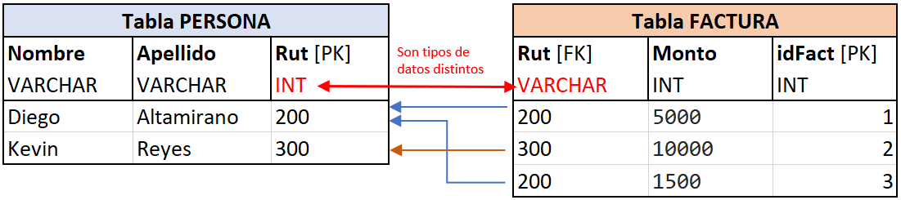
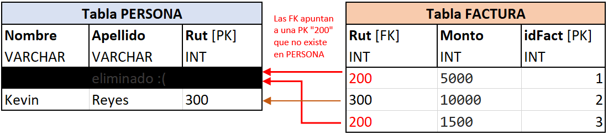
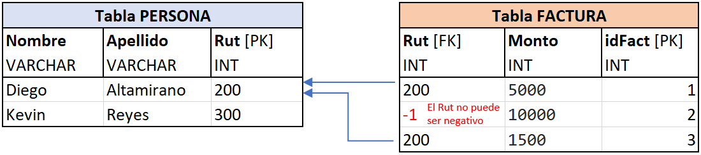

# Integridad Referencial

## Definición

La integridad referencial busca que las referencias mantengan su coherencia dentro de una base de datos. Esto indica que una clave referencia siempre **aluda a una fila válida** en la tabla a la que se haga referencia.

La definición de "fila válida" muchas veces dependerá del contexto donde este inserta la base de datos, a la par con sus contramedidas. Sin embargo, existen algunos casos que siempre deben ser solucionados, por ejemplo, una "fila inválida" es cuando los tipos de datos no coinciden entre referencias \(veáse primer caso en **Como se rompe una BD**\).

## Cómo se rompe en una BD

En una base de datos implementada siempre se debe buscar que se mantenga la Integridad Referencial. Sin embargo, algunos casos muy comunes donde esta **se rompe** son:

* Una clave foránea tiene un **tipo de dato distinto** a la columna que referencia

* Al eliminar una fila en la tabla referenciada, las claves foráneas de otra tabla **apuntan a una fila que ya no existe** 

**Observación:** Ante una situación del segundo tipo \(originada por la eliminación de datos\), la solución depende completamente del contexto. Por ejemplo, algunas opciones podrían ser **eliminar las filas en FACTURA,** o también, **trasladar las filas conflictivas a otra tabla "Respaldo"**. 

En este ejemplo, como por asuntos de contabilidad nos podría interesar guardar los montos \(aunque no tengan dueño\), la mejor solución sería mover las filas a una tabla respaldo. Esto es una forma de realizar un **borrado lógico,** o sea, borrar sin borrar, estilo Papelera de Reciclaje.

* Una clave foránea tiene un **tipo de dato incompatible** a las restricciones de la columna que referencia

Si asumimos que **Rut** \(en PERSONA\) ****tiene la restricción ****de que **debe ser mayor a cero.** La segunda fila en FACTURA tiene una clave foránea que **rompe las restricciones** puestas en la columna a la que referencia, cuando esto sucede, es un problema de integridad referencial.


Si desea una definición mas objetiva de este concepto, se recomienda revisar la sección 5.2 de este apunte: [http://gpd.sip.ucm.es/rafa/docencia/bdsi/apuntes/TEMA05.pdf](http://gpd.sip.ucm.es/rafa/docencia/bdsi/apuntes/TEMA05.pdf)


