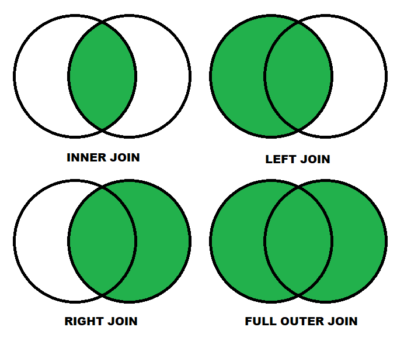

# Introducción a SQL

## ¿Qué es SQL?

SQL significa **Structured Query Language** \(Lenguaje de Consultas Estructuradas\).  Es el lenguaje estándar utilizado para la administración y recuperación de información en **Bases de Datos Relacionales.** 

Los DBMS Relacionales utilizan SQL para cumplir sus funciones de **Definición, Manipulación y Control de datos.** 

Es importante destacar que, si bien SQL es un lenguaje estándar, cada DBMS presenta pequeñas variaciones en la sintaxis que utilizan. **Las operaciones en cada DBMS son muy similares, pero no necesariamente idénticas.** Por ejemplo, si queremos obtener los 5 empleados con mayor salario en bases de datos MS SQL Server y MySQL:



```sql
SELECT TOP 5
    *
FROM
    Empleados
ORDER BY 
    salario DESC;
```



```sql
SELECT
    *
FROM
    Empleados
ORDER BY
    salario DESC
LIMIT 5;
```




Ambas consultas \(queries\) son equivalentes y entregarán el mismo resultado si operan sobre los mismos datos.


## Operaciones de Definición de Datos

Las operaciones de definición de datos, como el nombra indica, se utilizan para definir estructuras de datos \(tablas\) y elementos relacionados con dichas estructuras \(procedimientos, índices, etc\).


Las operaciones de Definición de Datos indican la lógica de cómo serán almacenados los datos. Se define la Base de Datos Lógica \(metadatos\). ****


Las 3 operaciones básicas son **CREATE, ALTER y DROP.** 

* La operación **CREATE** permite definir una tabla y sus atributos \(columnas\).
* La operación **ALTER** permite modificar las características de una tabla ya creada. Permite agregar, eliminar o modificar columnas y restricciones, entre otras cosas.
* La operación **DROP** elimina la tabla, **junto con toda la información que contiene.** 

En este apunte, nos enfocaremos en la **Creación de Tablas.**

### CREATE TABLE

A continuación, diseccionaremos un ejemplo de cómo crear tablas en PostgreSQL:



```sql
CREATE TABLE Alumno (
    rut INTEGER,
    nombre VARCHAR(45),
    id_carrera INTEGER,
    PRIMARY KEY (rut),
    FOREIGN KEY (id_carrera) REFERENCES Carrera (id)
);
```



```sql
CREATE TABLE Carrera (
    id INTEGER PRIMARY KEY,
    nombre_carrera VARCHAR(45) NOT NULL
);
```



Cosas que debemos notar:

* La tabla **Alumno** tiene de clave primaria `rut`, mientras que la la tabla **Carrera** tiene de clave primaria `id`.
* La tabla **Alumno** tiene una clave foránea, `id_carrera`, que apunta a la clave primaria de **Carrera**.
* Una tabla debe tener definida una clave primaria, y puede tener definidas tantas claves foráneas como sea necesario.
* La clave primaria puede ser más de un campo, para lo cual se escriben en el paréntesis separados por comas.
  * Por ejemplo: `PRIMARY KEY (campo_1, campo_2, ...)`
* En la tabla Carrera se explicita que el nombre de la carrera sea no nulo.
* Que un campo sea una clave primaria implica que éste debe ser **único y no nulo.**
  * **Esto no implica que la clave foránea id\_carrera deba ser no nula.**


Por ejemplo, puedo insertar un alumno con nombre y rut \(sin id\_carrera\) y entrará en la tabla sin problemas, lo que se traduciría a un alumno sin carrera. Si queremos exigir que todos los alumnos tengan una carrera, debemos explicitar **NOT NULL** para el campo `id_carrera`.


### Una Nota sobre CONSTRAINS

Las palabras reservadas que se utilizan para especificar detalles sobre la columna se denominan **restricciones \(constrains\).** Se utilizan para dar algunas condiciones especiales a ciertas columnas. Como se ve en el ejemplo anterior, las restricciones pueden definirse para la tabla \(como en la tabla Alumno\) o para la columna \(como en la tabla Carrera\).

Las más comunes son:

* **NOT NULL:** La columna no puede tener valores nulos.
* **UNIQUE:** Todos los valores en la columna deben ser distintos.
* **PRIMARY KEY:** NOT NULL + UNIQUE. Especifica **claves primarias.**
* **REFERENCES &lt;Tabla&gt;\(&lt;columna&gt;\):** El valor de la columna debe existir en `<columna>`. Es decir, especifica **claves foráneas.**
* **CHECK &lt;condicion&gt;:** La columna solo admite valores que cumplan con la condición.

Por ejemplo, si extendemos la tabla Alumno del ejemplo anterior y utilizamos restricciones, tenemos:

```sql
CREATE TABLE Alumno(
    rut INTEGER PRIMARY KEY,
    rol_usm INTEGER UNIQUE,
    nombre VARCHAR(45) NOT NULL,
    apellido VARCHAR(45) NOT NULL,
    id_carrera INTEGER REFERENCES Carrera (id),
    semestres_cursados INTEGER CHECK (semestres_cursados > 0),
    tipo_alumno VARCHAR(45) CHECK (tipo_alumno IN ('Regular','Parcial','Eliminado'))
);
```

### Tipos de Datos Comunes

Notar que los tipos de datos disponibles y sus definiciones pueden depender del DBMS.

| Tipo de Dato | Descripción |
| :--- | :--- |
| INTEGER | Valor entero. |
| FLOAT / DOUBLE | Valor decimal en punto flotante / doble precisión. |
| NUMERIC\(X, Y\) / DECIMAL\(X, Y\) | Valor decimal con X dígitos enteros e Y decimales. |
| VARCHAR\(X\) | String de hasta X caracteres. |
| TEXT | String indefinidamente largo \(para textos muy grandes\). |
| BOOLEAN / TINYINT | Valor booleano, verdadero \(1\) o falso \(0\). |
| DATE | Fecha \("2019-10-16"\). |
| TIME | Hora \("17:10:00"\). |
| DATETIME / TIMESTAMP | Fecha y Hora. |

## Operaciones de Manipulación de Datos

Las operaciones de manipulación de datos se utilizan para agregar, eliminar, modificar y buscar datos en la base de datos. 


Estas operaciones hacen uso de la Base de Datos Lógica ya creada, es decir, generan la Base de Datos Física.


Las 4 operaciones básicas son **INSERT, UPDATE, DELETE y SELECT.**

### **INSERT**

Se utiliza para agregar elementos \(entradas o filas\) a una tabla. La sintaxis básica es la siguiente:



```sql
INSERT INTO
    <tabla> (<columna_1>,<columna_2>,...)
VALUES
    (<valor_1a>, <valor_2a>,...),
    (<valor_1b>, <valor_2b>,...);
```



```sql
INSERT INTO Carrera
    (id, nombre_carrera)
VALUES
    (1, 'Ing Civil Informatica');

INSERT INTO Alumnos
    (rut, nombre, id_carrera)
VALUES
    (11111111, 'Diego Altamirano', 1),
    (22222222, 'Javier Mendoza', 1),
    (33333333, 'Kevin Reyes', 1),
    (44444444, 'Felipe Quintanilla', 1);
```



### UPDATE 

Se utiliza para cambiar el valor de algún atributo de la entrada. La sintaxis básica es la siguiente:



```sql
UPDATE
    <tabla>
SET
    <columna_1> = <nuevo_valor_1>,
    <columna_2> = <nuevo_valor_2>, ...
WHERE
    <condicion>;
```



```sql
UPDATE
    Carrera
SET
    nombre_carrera = 'I.C. Informatica'
WHERE
    id = 1;
```




Si se omite la cláusula WHERE, las operaciones UPDATE, DELETE y SELECT **afectan a todas las filas.**


### DELETE

Se utiliza para borrar **permanentemente** filas de una tabla. La sintaxis básica es la siguiente:



```sql
DELETE FROM
    <tabla>
WHERE
    <condicion>;
```



```sql
DELETE FROM
    Alumno
WHERE
    rut = 22222222;
```



### SELECT

Se utiliza para obtener datos de **una o más tablas.** La sintaxis básica es la siguiente:



```sql
SELECT
    <datos_a_obtener>
FROM
    <tabla>
WHERE
    <condicion>;
```



```sql
SELECT
    *
FROM
    Alumnos
WHERE
    rut > 30000000;
    
SELECT
    nombre, rut
FROM
    Alumnos;
```



#### Ejemplo 1

| rut | nombre | id\_carrera |
| :--- | :--- | :--- |
| 33333333 | Kevin Reyes | 1 |
| 44444444 | Felipe Quintanilla | 1 |

#### Ejemplo 2

| nombre | rut |
| :--- | :--- |
| Diego Altamirano | 11111111 |
| Javier Mendoza | 22222222 |
| Kevin Reyes | 33333333 |
| Felipe Quintanilla | 44444444 |




El operador **\*** significa **obtener todas las columnas de la tabla.** 


## Operaciones JOIN en SELECT

La operación SELECT permite hacer consultas bastante complejas. Por ejemplo, obtener datos de varias tablas distintas al mismo tiempo. Para ese tipo de consultas, se utiliza la operación JOIN dentro de SELECT.

La operación JOIN **junta columnas de 2 o más tablas horizontalmente,** emparejando las filas según algún atributo a comparar. Si tenemos una tabla **X** cuyas entradas llamaremos **x** y una tabla **Y** con entradas **y,** entonces una operación JOIN creará una tabla con **todas las combinaciones \(x,y\) que puedan ser emparejadas según el criterio.**


La operación JOIN, al igual que las Bases de Datos Relacionales, está basada en la Teoría de Conjuntos.


### Un ejemplo de JOIN

Supongamos que tenemos la siguiente base de datos, que guarda información sobre una empresa de desarrollo de software:



```sql
CREATE TABLE Empleado(
    INT rut NOT NULL PRIMARY KEY,
    VARCHAR(45) nombre,
    VARCHAR(45) especialidad,
    INT id_cubiculo NOT NULL,
    FOREIGN KEY (id_cubiculo) REFERENCES Cubiculo (id_cubiculo) 
);
```



```sql
CREATE TABLE Cubiculo(
    INT id_cubiculo NOT NULL PRIMARY KEY,
    VARCHAR(45) area_trabajo,
    INT piso_ubicado
);
```




Un empleado tiene alguna especialidad \(Diseño, Base de datos, TI...\) y trabaja en un cubículo ubicado en algún piso del edificio.


Suponga ahora que el supervisor del área de UX necesita saber **el nombre** **y en qué piso** están trabajando todos los empleados cuya especialidad es **Diseño.**


Si hacemos un SELECT sobre la tabla Empleado, **no obtendremos el piso.** Si lo hacemos sobre la tabla Cubículo, **no sabremos a qué empleado le pertenece el cubículo.**


Para hacer la consulta adecuada, necesitamos **emparejar cada empleado con su cubículo.** Por tanto, utilizaremos JOIN:

```sql
SELECT
    Empleado.nombre,
    Cubiculo.piso_ubicado
FROM
    Empleado
    INNER JOIN Cubiculo
        ON Empleado.id_cubiculo = Cubiculo.id_cubiculo
WHERE
    Empleado.especialidad = 'Diseño';
```

En la consulta se han escrito los nombres de las tablas a los que pertenecen los atributos \(en formato **Tabla.columna**\). Este formato se utiliza principalmente en consultas con más de una tabla para facilitar la lectura.


Si los atributos tienen los mismos nombres en ambas tablas, **su uso es obligatorio para evitar la ambigüedad** \(el lenguaje de consultas no es "adivino"\).


Algunas consideraciones finales:

* Pueden haber múltiples JOINs en una consulta.
* Si para una fila **x** puede emparejarse con **y1** e **y2,** entonces ambas parejas aparecerán en la tabla resultante.

### Tipos de JOIN

Existen 4 tipos de JOIN estándar, todos originados de la teoría de conjuntos. Para una consulta **X JOIN Y** se tiene:

* **INNER JOIN:** La tabla resultante son todas las parejas **\(x, y\),** donde **x** e **y** existen.
* **LEFT JOIN:** La tabla resultante son todas las parejas **\(x, y\) para todos los valores de x.** Si no hay pareja para algún **x,** se empareja con valores **NULL.**
* **RIGHT JOIN:** La tabla resultante son todas las parejas **\(x, y\) para todos los valores de y.** Si no hay pareja para algún **y,** se empareja con valores **NULL.**
* **FULL OUTER JOIN:** La tabla resultante son todas las parejas **\(x, y\) para todos los valores de x e y.** Si no hay pareja para algún **x** o **y,** se empareja con valores **NULL.**



## Operaciones de Control de Datos

Las operaciones de control de datos se utilizan para definir niveles de acceso a los datos contenidos en la Base de Datos. Su uso va más allá del ámbito de este curso.

