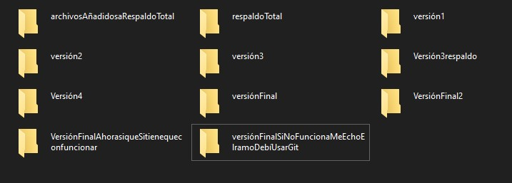
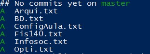
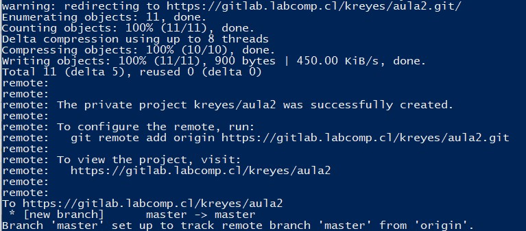
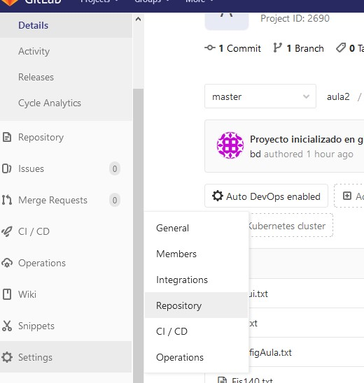

# Uso de Git

## ¿Qué es Git?

Es un sistema de control de versiones distribuido.  Se conoce como versión a un estado específico de un programa.   
Probablemente has trabajado con un sistema de control de versiones sin darte cuenta:



En la imagen anterior se muestra un directorio lleno de carpetas con nombres del tipo: versión1, versión2, versiónfinal, versiónFinalFinal, etcétera.

Se le llama S.C.V distribuido, ya que permite trabajar colaborativamente en un proyecto, ya sea, en una misma oficina o a distancia. Esto último nos será de gran utilidad en el desarrollo del semestre online, ya que Git nos entrega poderosas herramientas para trabajar en equipo, recuperar trabajo perdido, hacer Ctrl+Z nivel profesional y unificar trabajo de muchos desarrolladores de forma automática.  
El uso de git durante el semestre será opcional **\(a no ser que se indique lo contrario\)**, pero totalmente recomendable, ya que será una herramienta que utilizarán en su vida **profesional**.

## Aprenderemos a utilizar git a través del siguiente Escenario de Ejemplo

La plataforma Aula ha colapsado por el acceso masivo debido a las clases online, por lo que, dado que la plataforma maneja tanta información, requiere a unos expertos en Bases de Datos, se ha solicitado a los alumnos de Bases de Datos 2020-1 que puedan crear una nueva plataforma.  
Durante el desarrollo del tutorial trabajaremos con una carpeta llamada **aula** con los siguientes archivos \(los cuales son una simplificación del código real\):


A continuación el detalle de lo que contiene cada archivo:



```bash
- Noticias y Avisos
- Foro para consultas
- Programa Asignatura
- Evaluación de Asignatura
- Laboratorio
```



```
- Noticias y Avisos
- Foro para consultas
- Programa Asignatura
- Evaluación de Asignatura
- Notas tarea1
- Notas tarea2
- Notas Certamen
```



```
- Noticias y Avisos
- Foro para consultas
- Programa Asignatura
- Evaluación de Asignatura
- IDEA
```



```
- Noticias y Avisos
- Foro para consultas
- Programa Asignatura
- Evaluación de Asignatura
- El awa
```



```
- Noticias y Avisos
- Foro para consultas
- Programa Asignatura
- Evaluación de Asignatura
- Max F.O = nota
- Notas Finales
```



```
Lenguaje: Español
```



Cuando utilizas git, la herramienta se encargará de dar seguimiento a todos los cambios del proyecto. Para inicializar git en un proyecto existente debes ingresar el siguiente comando con el terminal en la carpeta **aula** del proyecto:

```
$ git init
Initialized empty Git repository in aula/.git/
```


 Cuando realizas git init se creará una carpeta oculta llamada **.git** donde se registrarán todos los cambios de tu proyecto, si deseas dejar de utilizar git en un proyecto, simplemente elimina esta carpeta.


### Configuraciones iniciales

Vamos a definir nuestra identificación como usuario git en el proyecto\(esto nos será útil cuando trabajemos colaborativamente\), nuestro usuario será: **bd,** y nuestro email: **bd@gmail.com.**

```bash
git config --global user.name "bd"
git config --global user.email "bd@gmail.com"
git config --global -l // Comando para ver configuraciones
```

Además, realizaremos alias de comandos más utilizados:

```bash
git config --global alias.lg "log --oneline --decorate --all --graph"
git config --global alias.s "status -s -b"
```

### ¿Qué es el Stage? 

Imagina que cada vez que quieres guardar una versión de tu aplicación es como tomar una fotografía a un escenario en donde pondrás todas aquellas cosas que quieres incluir en esa fotografía \(versión\). El Stage es el escenario, cada vez que registres una nueva versión de tu aplicación, lo que se registrará será lo que esté en el Stage.

### Git status

Muestra los archivos del directorio y su estado en el Stage, los archivos pueden tener varios estados, los principales son:

* **Sin seguimiento:** Git aún no ha hecho seguimiento de los cambios en estos archivos o folders.
* **Modificados:** Hay cambios en archivos que aún no han sido añadidos a git.
* **Eliminados:** Archivos eliminados.

A continuación, ejecutamos el comando:

```bash
git status
```


El color rojo en los archivos nos indica que estos aún no han sido añadidos al Stage.  


En adelante utilizaremos el alias **git s** que representa el comando **git status -s -b** el cual nos permite ver una versión más reducida de git status.


### Git add

Para añadir todo el proyecto al stage \(escenario\) utilizaremos el comando 

**"git add ." \(notar punto al final\),** el cual, añadirá archivos y carpetas completas. A continuación variaciones del comando:

* `git add Arqui.txt` : Añade solamente archivo Arqui.txt al Stage.
* `git add *.png`         : Añade todos los archivos con extensión png en el directorio actual.
* `git add pdfs/`         : Añade toda la carpeta pdfs al Stage \(no lo usaremos en el tutorial\)

```bash
git add .
git s       // Recordar que creamos un alias para git status
```




El punto en `git add .` significa "añade al Stage todos los archivos".


Ahora nuestros archivos ya están en el Stage \(Escenario\), por lo que podemos guardar la versión \(fotografía\) de nuestra aplicación con esos archivos en el Stage.

### Git commit

Para guardar la versión actual de nuestra aplicación utilizaremos el comando **git commit -m "&lt;ingresar mensaje que represente correctamente los cambios realizados en la versión&gt;"** 

```bash
git commit -m "Proyecto inicializado en git"
```


Si realizas git status, podrás ver que ya no hay ningún archivo, esto es porque te encuentras en la última versión que guardaste de tu aplicación y no hay ningún cambio que pudiéramos añadir al Stage que cambie tu versión.

```bash
git s
## master
```


No te preocupes por el significado de \#\# master, son algunas herramientas más avanzadas de git. Por el momento no las necesitas y están fuera del alcance de este tutorial.


### Git log

Cada commit que realices, guardará una versión \(foto\) de tu proyecto, por lo que cada commit tendrá un identificador único, algo así como una clave primaria con la cual podrás moverte hacia ese commit. Para ver todos los commits que has realizado utilizaremos el siguiente comando:

```bash
git log // Versión larga, con mucha información
git lg  // Versión corta, con información concisa. 
```

Si utilizas la versión corta del **log** obtendrás un output como el siguiente:


El código _**164d8b1**_ representa el identificador único del commit.

### Experimentemos el poder de Git

#### Escenario 1: Cómo hacer Ctrl-Z de forma profesional

A continuación, en tu editor de texto favorito, modificaremos el archivo **BD.txt** y **Arqui:**



```bash
// Alguien ha eliminado todos los foros e información del curso
- Notas tarea1
- Notas tarea2
- Notas Certamen
```



```
- Noticias y Avisos
- Foro para consultas
- Programa Asignatura
- Evaluación de Asignatura
// Alguien ha eliminado el laboratorio
```




Imagina que alguien ha eliminado miles de líneas de código y archivos informativos de BD y el laboratorio de Arqui para que nos los puedas recuperar jamás.


Si ejecutas el comando **git s,** verás algo como lo siguiente:


La letra **M** \(de Modified, o modificado\) ****en rojo simboliza que se han quitado lineas de código desde la última versión guardada. Por lo que, si añadiéramos estos archivos al **Stage** \(escenario\) ****e hiciéramos un commit \(fotografía\), guardaríamos una versión de nuestra aplicación con las miles de lineas de código y archivos informativos eliminados... y sin el laboratorio. Como no es lo que queremos, **¡utilizaremos el poder de git en nuestro proyecto!**  
Para recuperar nuestros archivos en su forma original, utilizaremos el siguiente comando:

```bash
git checkout -- .
```

Con esto, los archivos de tu proyecto volverán al mismo estado en que estaban en el último commit \(fotografía\) que realizaste.


Si has estado realizando cambios en tu proyecto y no has fotografiado esos cambios \(hacer un commit con ellos en el stage\), **perderás todo lo avanzado al ejecutar este comando.**


Si deseas moverte a un commit específico solo debes realizar **git checkout &lt;id commit&gt;** donde debes remplazar **&lt;id commit&gt;** por el id del commit obtenido con el comando **git log.** Luego de ejecutar el comando podrás ver que tus archivos tendrán el mismo contenido que cuando hiciste el commit con esa id \(fotografía\)**.**

### **¿Qué es Gitlab?**

Gitlab es un servicio en la nube para almacenar y administrar versiones de aplicaciones. Hasta ahora con git hemos trabajado a nivel local, existen múltiples servicios en la nube para subir el trabajo de git a la web, con el propósito de que equipos de desarrollo puedan trabajar en conjunto mediante la red de internet. Nosotros utilizaremos el servicio de Gitlab. 

Link de acceso: [https://gitlab.labcomp.cl/](https://gitlab.labcomp.cl/).  
Al iniciar sesión, verás una pantalla como la siguiente.


Para crear un proyecto, presiona **New project** pon un nombre acorde al formato solicitado en las tareas, marca la opción **Initialize repository with a README** y presiona en **Create project.** En nuestro caso lo nombraremos **aula.**

Nosotros ya tenemos un proyecto iniciado, por lo que crearemos un nuevo proyecto, pero desde consola. Para esto, ingresaremos el siguiente comando:

```bash
git remote add origin "https://gitlab.labcomp.cl/kreyes/aula2"
```

Donde debes remplazar **kreyes** por tu nombre de usuario. Hemos escrito **aula2** ya que ya habíamos creado un proyecto desde la web con nombre aula. Si bien no era necesario hacerlo, hemos hecho ese paso para que sepas que también puedes crear proyectos desde Gitlab.

Para añadir nuestros cambios y completar la creación del proyecto utilizamos los siguientes comandos:

### Git push

```bash
git push -u origin master
```

Se te pedirá ingresar tu nombre de usuario y contraseña de Gitlab.



Con esto nuestro proyecto ya está en Gitlab.

#### Escenario 2: Evitar pisarse los talones de forma Profesional


Considere el siguiente escenario: El profesor ha eliminado por error el curso de Infosoc por completo, lo cual ha quedado registrado en Gitlab.


Para continuar, desde Gitlab eliminaremos el archivo **Infosoc.txt** \(simulando ser el profesor\). ****Desde la página del repositorio hacemos click en el archivo y al abrirlo seleccionamos en **delete.**


Volvamos a la consola. Si revisamos nuestros archivos, notarás que **Infosoc.txt** sigue estando ahí. Por lo que, si hacemos un **git push** este, en teoría, volverá a estar en la página. 

```bash
git push
```


Para nuestra sorpresa, Gitlab nos impide realizar un push, ya que han habido cambios que no estamos considerando y, si hacemos push, podríamos borrar cambios de otros compañeros de equipo, o en este caso, el cambio que realizó el profesor.

### Git pull

Lo que haremos será utilizar el comando **git pull,** el cual revisará las diferencias entre nuestro código y el de Gitlab e intentará solucionar las diferencias de forma automática y subirá nuestro código. En caso de que hayamos modificado las mismas lineas con nuestros compañeros de equipo, git pull no podrá solucionarlo y tendremos que hacerlo manualmente.


Git es una herramienta inteligente, pero **no es adivina**. Si los cambios en un archivo son contradictorios, git no sabrá con cuál versión quedarse \(o cómo combinarlas apropiadamente\).


```bash
git pull
```


`git pull = git fetch + git merge`. Con git fetch traemos los últimos cambios desde gitlab y con git merge unimos los cambios de gitlab y los nuestros. Se recomienda investigar estos comandos por separado.



Hasta aquí ya has aprendido lo básico de git, lo que sigue es para valientes.


## Herramientas de git sólo para valientes


Lo que viene a continuación es más complicado, no es necesario entenderlo. Se deja el material porque puede ser un problema común cuando se está aprendiendo a usar git colaborativamente pero, idealmente, deben intentar no modificar los mismos archivos o no las mismas líneas al menos. 


En este caso, git pull resuelve eliminar el archivo **Infosoc.txt** de nuestra computadora. ¿Está todo perdido? No, lo que haremos será con checkout movernos al commit inicial.

```bash
git checkout e0a8d2e
```

En mi caso **e0a8d2e** es el id de mi primer commit, para revisar el suyo deben utilizar **git lg**.

 Con esto verás nuevamente tu archivo, pero, en git hay varias cosas que arreglar para seguir trabajando, la solución planteada aquí no es la mejor, pero es la más simple al momento de comenzar en git.



Nos vamos a las configuraciones de repositorio, en **protected branch** eliminamos la protección, seleccionando Unprotect.


Luego en consola ingresamos el siguiente comando:

```bash
git push -f origin HEAD:master
```

Con esto se cargarán los archivos en gitlab y habrán recuperado los datos perdidos.

Finalmente: 

```bash
git reset --hard e0a8d2e
```

Y tendremos nuestro git tal cual estaba en un principio.


Se recomienda volver a activar la protección.


Te recomendamos jugar con los comandos en proyectos falsos y no en tus tareas reales, cuando comiences a utilizar git en tus tareas reales te recomendamos utilizar el sistema de control de versiones **ancestral** hasta que hayas consolidado el aprendizaje de git.

Documentación adicional: [https://git-scm.com/docs](https://git-scm.com/docs)

