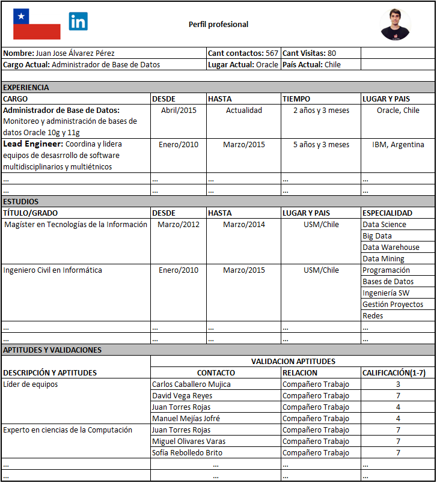
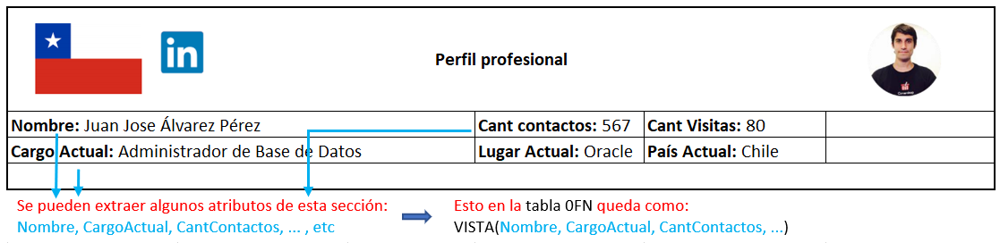
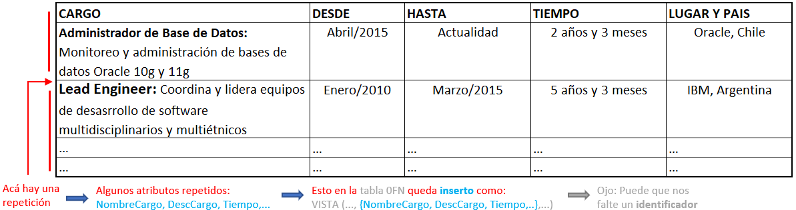
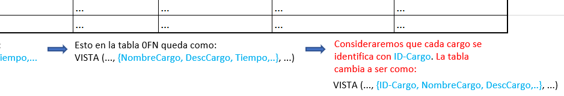

# 0FN - Extracción de atributos

## Contexto pre-normalización

Nosotros al querer normalizar, tendremos una **vista**, la cual por lo general corresponderá a la interfaz que se utiliza con la base de datos que deseamos crear

Como se ha mencionado, dentro de la normalización iremos "creando tablas" para ir deduciendo la estructura de la base de datos detrás, para ello, comenzaremos en **0FN creando una tabla que contenga todos los elementos o atributos presentes en la interfaz.**

Al hacer esto, junto con algunas consideraciones, nosotros buscamos "preparar la cancha" para cuando vayamos avanzando en las formas normales \(pasos de normalización\). 

### Tareas en 0FN

Los pasos que nosotros debemos realizar en esta parte son:

* Extraer todos los datos que tenemos en la vista, desde atributos explícitos \(como datos que vemos directamente\) o implícitios que vayamos a considerar o suponer.
  * Las **repeticiones** se colocan como un sólo elemento encerrado en **llaves** "{...}".
  * Si existen **repeticiones dentro de las repeticiones** se coloca un nuevo subconjunto dentro de la llave actual "{...,{...}}".

* Detectar si necesitaremos añadir **identificadores** para que la normalización futura funcione
  * Este paso es completamente realizable a medida que vamos normalizando. Por lo general después de practicar la consideración de identificadores nace de manera intuitiva.

* Finalmente, asegurarse que exista **consistencia** en los datos extraídos. De no hacerlo, en la última etapa de la normalización tendremos problemas que serán mas complejos de solucionar.
  * Por ejemplo, si en una sección de la vista tenemos un atributo _"Fecha y Hora"_ y en otra tenemos dos atributos _"Fecha"_  y _"Hora"_ de manera separada, debemos decidir si separar los atributos o considerar dos distintos. Esto es importante para cuando lleguemos a la **Integración.**

### Resultado ejercicio

En la pauta de este ejercicio, podemos ver que se realizaron las consideraciones mencionadas, quedando como la siguiente tabla:

