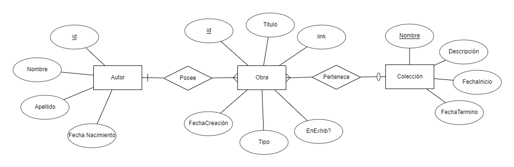

# PHP: Un ejemplo

## [La Galería INF-izi](https://es.wikipedia.org/wiki/Galer%C3%ADa_Uffizi)

Un grupo de informáticos decidió que el semestre online será su perdición, por lo que decidieron salirse de la carrera e invertir en un innovador emprendimiento: una galería de arte online que la gente puede visitar desde sus casas. Sin embargo, como se salieron de la carrera, no tienen idea de cómo implementar sus ideas en una Base de Datos.

Como un primer acercamiento, este grupo plantea el siguiente Modelo:

En el modelo, se aprecian las siguientes entidades:

* **Un Autor,** el cual se identifica por un id auto-incremental.
* **Una Obra,** la cual se identifica por un id que es asignado por el Administrador del museo, además de tener un tipo \(Pintura, Escultura, Instalación, Otro\) y un indicador si está actualmente en exhibición. El atributo link se refiere a un link hacia la foto \(como [este](https://upload.wikimedia.org/wikipedia/commons/6/66/VanGogh-starry_night_ballance1.jpg)\). Un autor posee varias obras de arte, y una obra pertenece a un único autor.
* **Una colección,** la cual tiene una duración determinada \(para hacer anuncios y atraer visitas\) y engloba a un conjunto de obras de arte bajo una misma categoría. Una colección tiene muchas obras, y una obra pertenece a máximo una colección.

De primeras, el equipo de informáticos necesita una vista de Administrador que permita implementar las siguientes funcionalidades:

* **Insertar a la Base de Datos un Autor.**
* **Insertar a la Base de Datos una Obra,** indicando el id de su autor. Por defecto, las obras al crearse deben estar **no en exhibición.** El id de la obra es siempre un string de 7 caracteres.
* **Insertar a la Base de Datos una Colección,** donde la fecha de inicio siempre será el día en que se insertó la colección a la base de datos. 
* **Asignar una Obra a una Colección,** indicando el id de la obra y el nombre de la colección.
* **Alternar el estado de una Obra** de estar no exhibida a exhibida y viceversa.

Además, para certificar la calidad de su trabajo, le piden que tenga en consideración las siguientes validaciones:

* No se debe insertar un autor, obra o colección si ya existe uno con el mismo identificador.
* Al insertar una obra, el autor indicado debe existir.
* Al asignar una obra a una colección, tanto la obra como la colección deben existir.
* Al alternar el estado de una obra, esta debe existir.

Finalmente, el grupo de ex-estudiantes le piden un **dump** de su Base de Datos, para simplemente llegar y cargar en sus máquinas.

## Anexo: Detalle del Modelo del Problema

A continuación, el detalle del Modelo mostrado en la imagen:

* **Autor:** Posee los atributos:
  * **id:** un valor numérico auto-incremental
  * **Nombre:** un string con el nombre del autor.
  * **Apellido:** un string con los apellidos del autor.
  * **FechaNacimiento:** una fecha correspondiente al día de nacimiento del autor.
* **Obra:** Posee los atributos:
  * **id:** un string de 7 caracteres ingresado por el Administrador para identificar la obra.
  * **Titulo:** un string con el título de la obra.
  * **link:** un string con el link a una imagen de la obra.
  * **FechaCreacion:** una fecha correspondiente al día en que la obra fue concebida.
  * **Tipo:** un string que puede ser Pintura, Escultura, Instalación u Otro.
  * **EnExhib:** un atributo que indica si la obra está o no en exhibición.
* **Colección:** Posee los atributos:
  * **Nombre:** un string con el nombre de la exhibición. Es clave primaria.
  * **Descripción:** un string con una breve descripción de la exhibición.
  * **FechaInicio:** una fecha que indica cuando comienza a valer la colección.
  * **FechaTermino:** una fecha que indica cuando ya no se considera la colección.

