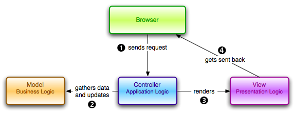

# Patrón Modelo-Vista-Controlador

Al desarrollar aplicaciones informáticas, surgen problemáticas recurrentes en distintos contextos, por lo que,  se han desarrollado soluciones estándar a estas problemáticas, las cuales pueden ser adaptadas al contexto específico en el que estamos desarrollando, si juntamos el problema conocido y la solución conocida obtenemos lo que se llama un patrón de diseño de software.

Uno de los patrones más comunes es el patrón arquitectónico modelo-vista-controlador \(MVC\), que impone una separación de la ”lógica del dominio” \(también llamada ” lógica de negocio ” \) y la ”lógica de presentación” que está asociada con la interfaz gráfica de usuario \(GUI\). En el caso de las aplicaciones web, la ”lógica de dominio” por lo general se compone de modelos de datos para cosas como los usuarios, artículos y productos, y la interfaz gráfica de usuario es sólo una página web en un navegador web. El Modelo Vista Controlador permite separar nuestro código en tres partes, las cuales explicamos en el lenguaje de programación Ruby junto con el framework Ruby On Rails:

•    **El Modelo:** Está formado por clases, cada clase es un modelo, y cada modelo representa una tabla en la base de datos. Por tanto el Modelo es el encargado de trabajar con la lógica de la base de datos. Nosotros podríamos tener un Modelo Persona y una tabla personas, desde la clase Persona trabajaremos con todo lo relacionado a la tabla personas.

•    **La Vista:** Es la representación final de una petición, dentro de una vista hay más que nada código html, seguramente también habrá código Ruby, pero será mínimo, como imprimir una variable por pantalla o mostrar un listado de un arreglo. Pero más que nada la Vista se encargará de la presentación, lo que ve el visitante y no de la lógica de la petición.

•    **El Controlador:** Este, en cambio, sí se encargará de la lógica de la petición. A su vez hará de puente entre el Modelo y la Vista. Cada controlador será una clase con métodos, y por cada método \(o acción que se le llama en el controlador\) habrá una vista que representará la versión procesada de ese método.

Al interactuar con una aplicación Rails, un navegador envía una solicitud, la cual es recibida por un servidor web y se transmite a un controlador de Rails. En algunos casos, el controlador hará que una vista \(que es una plantilla convertida a HTML\) se envíe de vuelta al navegador. Además, el controlador interactuará con un modelo , que es un objeto Ruby que representa un elemento del sitio \(por ejemplo, un usuario\) y está a cargo de la comunicación con la base de datos. Después de invocar el modelo, entonces el controlador representa la vista y devuelve la página web completa en el navegador como HTML.

