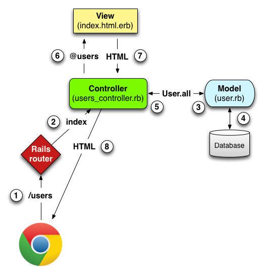

# Ruby On Rails

### Tu primera aplicación

Ruby on Rails es un framework de desarrollo de aplicaciones web de Ruby, una de las razones por las que **Ruby on Rails** es tan popular es que trae una poderosa aplicación de consola que nos permite, entre otras cosas, generar código a través de comandos llamados **generadores,** a continuación el comando generador para generar una aplicación básica:

```text
rails new [nombre del proyecto]
```

Para iniciar el servidor con nuestra aplicación utilizamos:

```text
rails server
```

Uno de los fuertes de Ruby, son sus gemas, éstas son librerías que se instalan y quedan listas para usar \(incluso Rails es una de ellas\), todas ellas están establecidas en el archivo Gemfile y se instalan con el comando "bundle install".

Para ver el servidor en ejecución, abran en su navegador [http://localhost:3000](http://localhost:3000) y podrán ver la página de inicio de RoR.

En la siguiente tabla se explica un poco las partes más importantes de un proyecto Rails.

| Archivo/Carpeta | Propósito |
| :--- | :--- |
| app/ | Contiene los **controllers**, **models**, **views**, helpers, mailers y assets para tu aplicación. Te centrarás en esta carpeta por el resto de esta guía. |
| config/ | Configura las reglas de ejecución de la aplicación, **rutas**, base de datos y más. |
| db/ | Contiene el esquema actual de tu base de datos, así como las migraciones de la base de datos. |
| Gemfile Gemfile.lock | Estos archivos te permiten especificar qué dependencias de gemas son necesitadas para tu aplicación Rails. Estos archivos son usados por la gema Bundler, ver [Sitio web de Bundler](http://gembundler.com/). |

**Ruby on Rails** usa un concepto llamado [convención sobre configuración](http://es.wikipedia.org/wiki/Convenci%C3%B3n_sobre_Configuraci%C3%B3n) para que la estructura de todos los proyectos sea similar y escribamos menos código.

La desventaja de la [convención sobre configuración](http://es.wikipedia.org/wiki/Convenci%C3%B3n_sobre_Configuraci%C3%B3n) es que muchas cosas en Rails te van a parecer magia al principio. No te preocupes, es normal y con el tiempo uno aprende a entender, e incluso a apreciar, lo que está ocurriendo.

## Los componentes de Rails <a id="los-componentes-de-rails"></a>

Los componentes más importantes de **Ruby on Rails** y que veremos en más detalle a continuación son:

* El **enrutador**, que se configura en el archivo `config/routes.rb` y nos permite asociar las **rutas** con las **acciones**.
* Los **modelos**, que se encuentran en la carpeta `app/models` y son el puente entre tu aplicación y la base de datos.
* Los **controladores**, que se encuentran en la carpeta `app/controllers` y almacenan las **acciones**.
* Las **vistas**, que se encuentran en `app/views`, y nos permiten definir el código HTML que se renderiza desde los **controladores**.
* Un componente que no conoces aún es **ActiveRecord**, que nos va a permitir interactuar con la base de datos.
* Por último, la **aplicación de consola**, que nos va a permitir ahorrar tiempo de desarrollo.

Para entender de mejor forma la relación de cada entidad, veremos este ejemplo para mostrar todos los usuarios del modelo "Users" y mostrarlos en una pagina de la aplicacion:



**Explicación de diagrama:**

1. El navegador hace una solicitud hacia una cierta "**ruta**", en este caso **"/users"**
2. La ruta esta definida en el archivo **routes.rb** y ésta le dice a Rails que debe ejecutar el **método "index"** del **controlador "Users"**
3. El **método index** llama al **modelo Users** pidiéndole todos los registros con **"User.all"**
4. El modelo consulta a la base de datos.
5. El modelo le devuelve al controlador lo que el consultó y éste guarda estos datos en la variable **"@users"**
6. El **método "index"** llama a renderizar la **vista "index"**, la variable **"@users"** es pasada a ésta vista **\(Debido al prefijo "@"\).**
7. La vista usa esta variable para renderizarse y contesta al controlador con un HTML.
8. El controlador envía al navegador la vista HTML para que sea visible al usuario

## Los Modelos <a id="los-modelos"></a>

**ActiveRecord** es la capa que nos permite acceder y manipular la información de la base de datos sin necesidad de escribir codigo SQL.

El concepto más importante de **ActiveRecord** es el **modelo**. Un **modelo** es una clase de Ruby que representa una tabla en la base de datos:

```ruby
class Book < ApplicationRecord
end
```

Los modelos se encuentran en la carpeta `app/models`.

En el **modelo** no se definen las columnas de la tabla explícitamente, **ActiveRecord** las toma de la tabla directamente.

### Nuestro primer modelo <a id="nuestro-primer-modelo"></a>

Para generar un modelo se debe ejecutar:

```ruby
rails generate model NombreModelo atributo1:tipo1 atributo2:tipo2 ...
```


Nombres de modelo en **INGLES**, **SINGULAR** y **EMPEZANDO CON MAYÚSCULA**.

Nombres de atributos en **INGLES**, **SINGULAR** y **MINÚSCULA**.

_Rails automáticamente creará una tabla relacionada con nombre en minúscula y en plural._


Varias cosas que debes tener en cuenta:

* Puedes escribir `generate` ,o más corto, `g`.
* Los campos se separan por **espacio**.
* Puedes definir el tipo del campo utilizando `:` seguido del tipo de datos \(sin espacios!\).
* Los tipos más comunes son: `string`, `text`, `integer`, `decimal`, `date`, `time`, `datetime`, `boolean` y `references`.
* Si el tipo es `string` puedes definir la longitud máxima con llaves al final: `string{10}`
* Si omites el tipo del campo se asume que es `string{255}`.
* Los campos `id` \(llave primaria\), `created_at` y `updated_at` se crean de forma automática, no hay necesidad de especificarlos en el comando.

El **comando anterior** va a crear varios archivos, entre esos:

* El modelo \(La clase `NombreModelo`\) en `app/models/nombremodelo.rb`.
* Un archivo en `db/migrate` con las instrucciones para crear la tabla. A esto se le conoce como una **migración**.

### Migraciones <a id="migraciones"></a>

Siempre que se edite, cree o elimine un modelo, se creará un archivo de migración en /db/migrations, estos archivos contienen las ordenes que harán que se creen, edite, o eliminen las tablas correspondientes de la base de datos.

Para correr las migraciones pendientes se debe ejecutar el siguiente código.

Por lo que siempre al crear un modelo se debe ejecutar:

```ruby
rails db:migrate
```

Esto se debe hacer siempre luego de  editar, crear o eliminar un modelo.

### Agregando registros <a id="agregando-registros"></a>

Para jugar un poco con los modelos y la base de datos, se puede usar la consola de rails.

```ruby
rails c
```

Para agregar un registro:

```ruby
<Nombre_Modelo>.create(:<atributo> => dato,...) #sin los <>
```

Por ejemplo**:**

```ruby
Curso.create(nombre:"Bases de Datos", profe: "Cecilia Reyes")
```

#### Crear nuevo registro \(sin agregarlo inmediatamente\): <a id="crear-nuevo-registro-sin-agregarlo-inmediatamente"></a>

```ruby
<variable> = <Nombre_Modelo>.new
```

Luego, los datos pueden asignarse de la siguiente manera, uno por uno:

```ruby
variable.atributo = dato
```

Y para agregar el registro creado:

```ruby
<variable>.save
```

### Listar los registros <a id="listar-los-registros"></a>

```ruby
<nombre_modelo>.all
```

### Mostrar el primer registro con una condición <a id="mostrar-el-primer-registro-con-una-condicion"></a>

```ruby
Curso.find_by(nombre:"Bases de Datos")
```

### Mostrar todos los registros que cumplen ciertas condiciones <a id="mostrar-todos-los-registros-que-cumplen-ciertas-condiciones"></a>

Ademas se le puede agregar que los muestre con un cierto orden:

```ruby
Libro.where(autor:’David’, ano:’2015’).order(created_at: :desc)
```

### Buscar un registro por id <a id="buscar-un-registro-por-id"></a>

```ruby
<nombre_modelo>.find(id)
```

### Actualizar registro: <a id="actualizar-registro"></a>

Una vez encuentras un registro, puedes actualizarlo concatenando las funciones

```ruby
Libro.find_by(id:1).update(titulo:"Oceanos")
```

### Eliminar un registro por id <a id="eliminar-un-registro-por-id"></a>

Una vez encuentras un registro, puedes eliminarlo concatenando las funciones

```ruby
<nombre_modelo>.find(x).destroy
```

## Controladores, vistas y rutas <a id="controladores-vistas-y-rutas"></a>

El objetivo principal de **Ruby on Rails** es el de asociar **rutas** \(p.e. `/books`, `/users`, etc.\) a **métodos de Ruby** que se encarguen de responder las peticiones HTTP.

Las asociación entre rutas y métodos se define en el archivo `config/routes.rb`.

A las clases que contienen los métodos asociados a rutas se les conoce como **controladores** y se encuentran en la carpeta `app/controllers`.

### Creando un Controlador <a id="creando-un-controlador"></a>

Vamos a generar nuestro primer **controlador** ejecutando el siguiente comando:

```ruby
rails g controller NombreControlador
```


Nombres de controlador en **INGLES**, **PLURAL** y **EMPEZANDO CON MAYÚSCULA,** si tiene un modelo asociado, el controlador **DEBE LLAMARSE** **IGUAL** al modelo, pero en PLURAL.

Nombres de vistas en **INGLES**, **SINGULAR** y **MINÚSCULA \(por ejemplo**`index`, `show`, `new`, `create`, `edit`, `update`, `delete`**\)**


Este comando va a crear varios archivos. Entre ellos el **controlador** en `app/controllers/nombrecontrolador_controller.rb`.

Abre el controlador y vamos ahora a crear un método `index` dentro de ese **controlador**. Te debería quedar de la siguiente forma:

```ruby
class NombreControladorController < ApplicationController  
    def index    
    end
end
```

A los métodos dentro de un **controlador** se les conocen como **acciones**.

Por último, vamos a asociar el método `index` a la ruta /nombrecontrolador/`index`. Abre el archivo `config/routes.rb` y asegúrate de que quede como se muestra a continuación:

```ruby
Rails.application.routes.draw do 
    get 'nombrecontrolador/index'
end
```

Ahora si ingresas desde tu navegador a [http://localhost:3000/nombrecontrolador/index/](http://localhost:3000/home/) se llamara al método index del controlador. Pero este método aun no hace nada... ¿o no?

### Utilizando una vista <a id="utilizando-una-vista"></a>

Las **vistas** son archivos que se encuentran en la carpeta `app/views`.

Lo interesante de las **vistas** es que podemos mezclar código HTML con código Ruby.

Por convención Rails va a buscar un archivo que se llame igual al método \(ignorando la extensión\) y que se encuentre dentro de una carpeta que se llame igual al controlador.

Por lo que para crear nuestra primera vista crea un carpeta llamada `nombre_controlador` dentro de `app/views` y crea un archivo llamado `index.html.erb` dentro de esa nueva carpeta con el siguiente contenido:

```ruby
<% 3.times do %>  
    <p>Hola Mundo</p>
<% end %>
```

Fíjate que el código Ruby se debe embeber en las etiquetas `<%` y `%>`.

Si refrescas la página deberías ver la frase "Hola Mundo" tres veces.

### Crear Controlador y Vistas al mismo tiempo <a id="crear-controlador-y-vistas-al-mismo-tiempo"></a>

Una forma de saltar todo el proceso de vincular una vista y un controlador es crearlas al mismo tiempo con:

```text
rails g controller NombreControlador nombrevista1 nombrevista2 ...
```

### Definiendo la página de inicio <a id="definiendo-la-pagina-de-inicio"></a>

ara asociar la raíz del proyecto \(la ruta inicial `/`\) con la **acción** `index` debes modificar el archivo `config/routes.rb` para que quede de la siguiente forma:

```ruby
Rails.application.routes.draw do  
    root 'nombrecontrolador#index'
end
```

Ahora ingresa a [http://localhost:3000/](http://localhost:3000/). Debería aparecer "Hola Mundo" tres veces nuevamente.

### Pasando información del controlador a la vista <a id="pasando-informacion-del-controlador-a-la-vista"></a>

Cuando defines una **variable de instancia** \(las que comienzan con `@`\) en la **acción**, esta variable va a estar disponible en la vista. Por ejemplo:

```ruby
class NombreControladorController < ApplicationController  
    def index    
        @name = "Pedro"  
    end
end
```

La variable `@name` va a estar disponible en la vista \(`app/views/nombrecontrolador/index.html.erb`\) y la podemos mostrar de la siguiente forma:

```markup
<h1>Hola <%= @name %></h1>
```

La etiqueta `<%=` le indica a **Rails** que queremos mostrar la variable en la pantalla. Uno de los errores más comunes es olvidar agregar el igual `=` y no entender por qué no aparece la variable en la pantalla.


**Desde los métodos puede hacerse uso de los modelos.**


### Parámetros GET <a id="query-string"></a>

Los **parámetros GET** es el conjunto de propiedades que van después del signo de interrogación \(`?`\) de un URL. **Rails** automáticamente convierte las propiedades en el hash `params` que puedes acceder desde el **controlador** o la **vista**.

Por ejemplo, si queremos obtener el valor de una propiedad llamada `name` utilizaríamos `params[:name]`. Por ejemplo:

```markup
<h1>Hola <%= params[:name] %></h1>
```

Los valores siempre llegan como cadenas de texto. Si deseas otro tipo debes convertirlo manualmente. Por ejemplo:

```markup
<h1>En cinco años tendrás <%= params[:age].to_i + 5 %> años</h1>
```

En este caso estamos convirtiendo la propiedad `age` a un entero para poderlo sumar a `5`.

